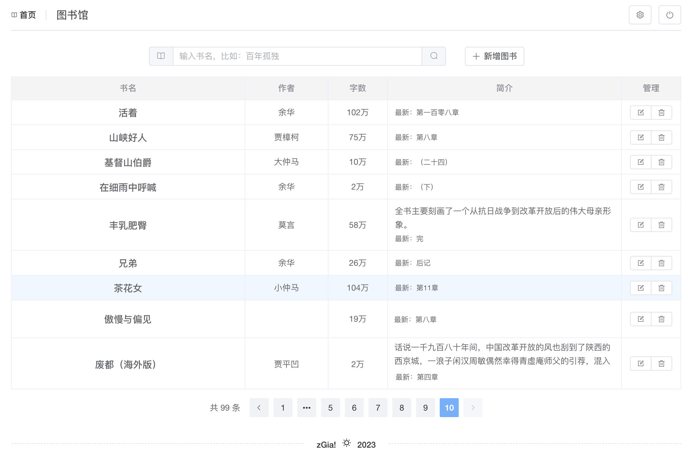

# Library

> 一个简单的图书管理系统

## 预览
``申明：以下图书信息仅供本代码演示用，作者的数据库中并没有保存这些图书。``

[](./books.png)
[](./book-index.png)
[](./book-chapter.png)

## 接口

[zgia/book-go](https://github.com/zgia/book-go.git)

[zgia/book-php](https://github.com/zgia/book-php.git) (停止维护)


## 安装依赖

```bash
npm install
```

### 开发模式

```bash
npm run dev
```

### 生产环境

```bash
npm run build
```

### 详细步骤

```bash
git clone https://github.com/zgia/book-frontend.git
cd book-frontend
npm install
npm run dev
```

### 自定义主题

See `src/styles/element/index.scss`.

参考 https://github.com/element-plus/element-plus-vite-starter