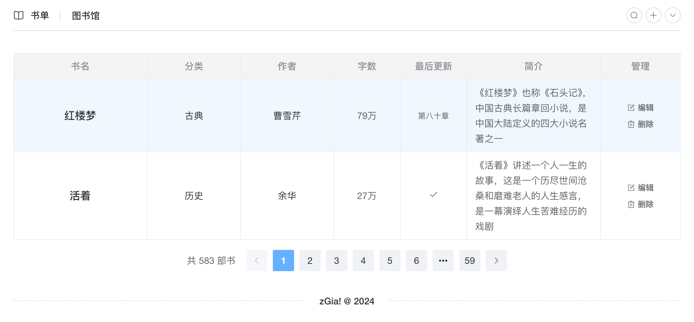
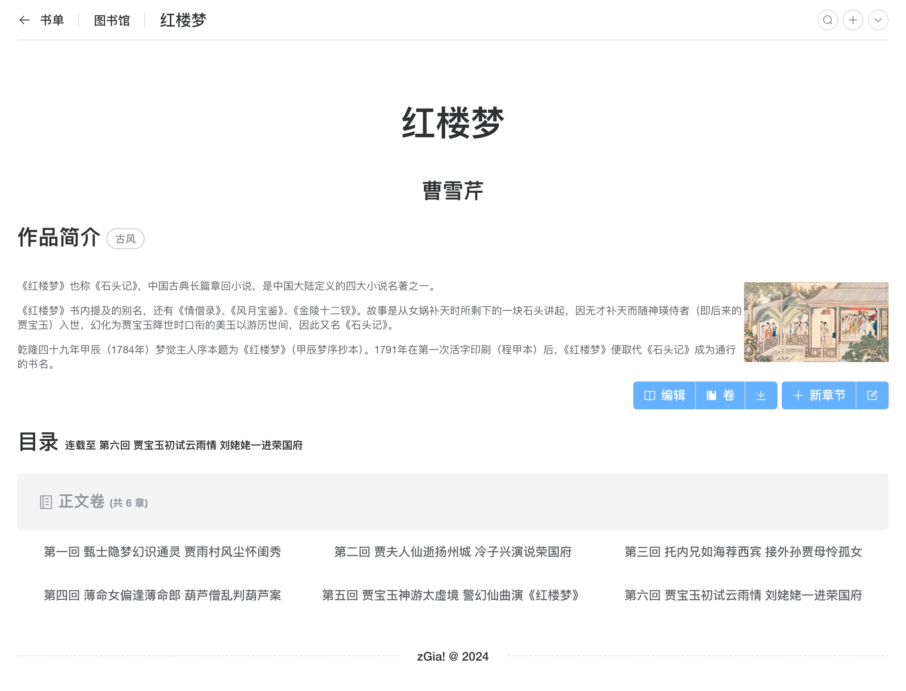
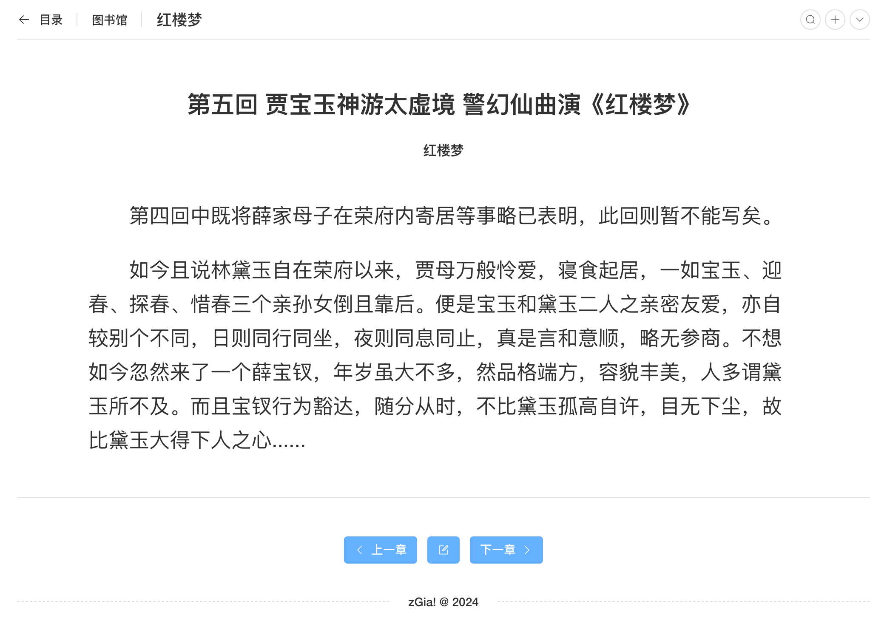

# Library

> 一个简单的图书管理系统
1. 阅读某一章节时时，支持简单的手势，比如左右滑动、双击页面两侧进行前后翻页。
2. 可阅读某一卷的所有章节
3. 可下载为文本文件
4. 可根据书名、作者、内容等关键字搜索
5. 支持使用快捷键打开搜索对话框（meta+K）和新建图书对话框（meta+B）
6. 在简体中文、繁体中文和英文切换
7. 支持深色模式（默认为浅色）
8. 响应式布局，支持移动端设备

> TODOLIST
1. 阅读时，添加书签


## 预览
``申明：以下图书信息仅供本代码演示用，作者的数据库中并没有保存这些图书。``

[](./books.png)
[](./book-index.png)
[](./book-chapter.png)

## 接口

[zgia/book-go](https://github.com/zgia/book-go.git)

## 命令行

```bash
npm install
npm run dev
npm run build
```

### 详细步骤

```bash
git clone https://github.com/zgia/book-frontend.git
cd book-frontend
npm install
npm run dev
```

### 自动加载组件
```javascript
  AutoImport({
    resolvers: [
      ElementPlusResolver(),
      // others...
    ],
    imports: [
      'vue',
      'vue-router',
      'pinia'
    ],
    dts: 'src/auto-imports.d.ts',
  }),
```

配置 `eslint.config.mjs` 内的 `globals`，避免错误提示


### 自定义图标，自动加载图标

See `vite.config.ts` 内的 `unplugin-icons`配置.

### 自定义主题

See `src/styles/element/index.scss`.

参考 https://github.com/element-plus/element-plus-vite-starter